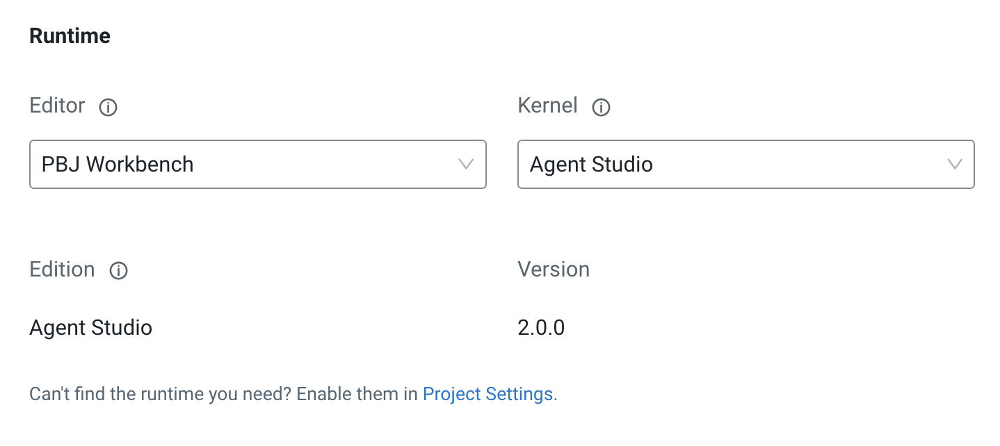

# September 30th, 2025

*Runtime Version: 2.0.0*

## Airgapped Environment Support

Installation in airgapped environment has been simplified by publishing the agent studio as a custom runtime image. You can read more about setup in airgapped environment here: [Airgap Setup](../../user_guide/airgap_installation.md)

## Bedrock Support

Agent Studio now supports Bedrock as an LLM model provider. 


## Removed the Ops & Metrics Application

Agent Studio now ships with only one application, which is the main Agent Studio application. The legacy **Agent Studio - Agent Ops & Metrics** application now runs directly as part of the **Agent Studio** application, and can be viewed at `https://<agent-studio-url>.com/ops`. All test workflows are written to this embedded Ops & Metrics server.


## Dedicated Ops & Metric Server per Each Deployed Workflow

Previously, all telemetry for all deployed workflows were written to the centralized **Agent Studio - Agent Ops & Metrics** application. Now, each deployed workflow is configured with its own Ops & Metrics server which is automatically configured upon deployment. All workflow executions are logged in that workflow's dedicated Ops & Metrics server, which can be accessed at `https://<workflow-url>.com/ops`. All workflows executed in Test mode are still written to the Ops server that's directly embedded in the main Agent Studio application.


## Better Custom Applications API

Previously, custom applications required end users to:
* base64-encode worfklow inputs,
* send workflow kickoff requests directly to the workflow engine model endpoint, and 
* poll for events from the centralized **Agent Studio - Agent Ops & Metrics** application. 

Now, each deployed workflow application ships with a unified API surface that can be used to build custom experiences on top of! Two unique endpoints are exposed to each deployed workflow:

```bash
# send POST requests to kickoff a workflow
https://<workflow-url>.com/api/workflow/kickoff

# receive events from a specific workflow execution
https://<workflow-url>.com/api/workflow/events?trace_id=...
```

Deployed worfklows have API documentation that can be accessed directly from the application itself, including direct `curl` commands as examples for running workflows.

You can read more about custom applications and the deployed workflow API here: [Custom Applications](../../user_guide/custom_workflow_application.md)


## Agent Studio Runtimes

Starting this release, Agent Studio now ships as a fully supported Cloudera AI [Runtime](https://docs.cloudera.com/machine-learning/cloud/architecture-overview/topics/ml-architecture-overview-runtimes.html). Installing Agent Studio as a runtime comes with the following benefits:
* Significantly improved installation times, upgrade times and workflow deployment times
* Ease of installation in airgapped environments

You can read more about Agent Studio Runtimes here: [Runtimes](../../user_guide/runtimes.md)



## UI Bugfixes and Enhancements

Several bugfixes and enhancements have been made to the Agent Studio UI, including:

* TBD