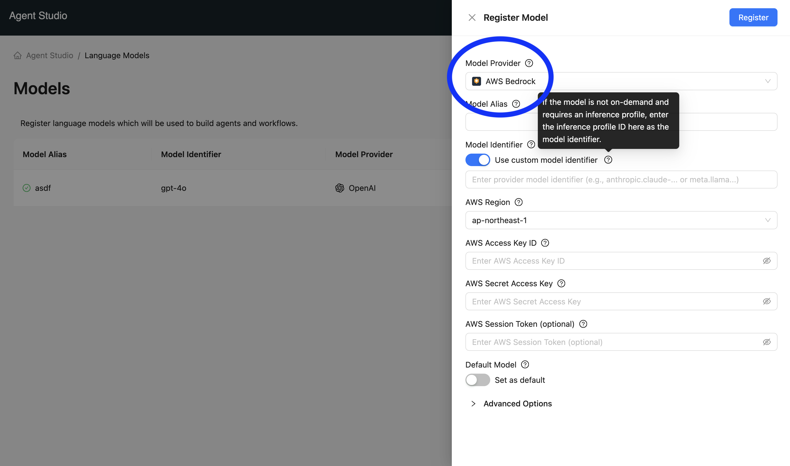
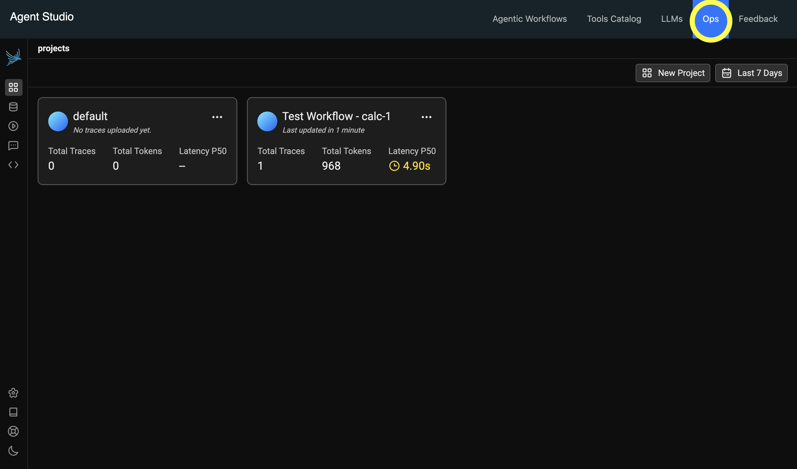
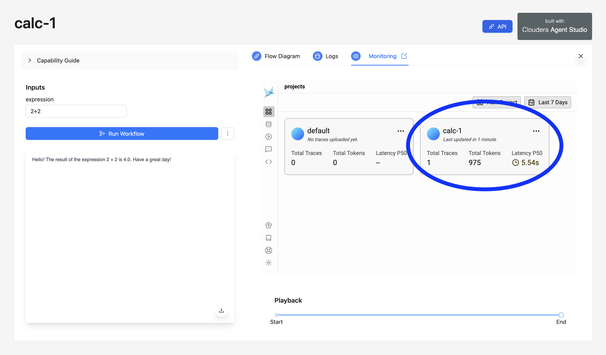
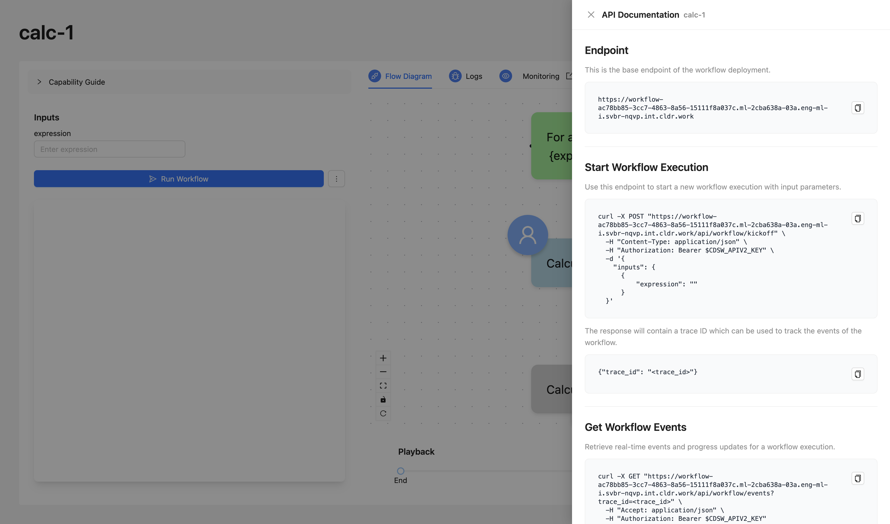

# September 30th, 2025

*Runtime Version: 2.0.0*

## Airgapped Environment Support

Installation in airgapped environment has been simplified by publishing the agent studio as a custom runtime image. You can read more about setup in airgapped environment here: [Airgap Setup](../../user_guide/airgap_installation.md)

## Bedrock Support

Agent Studio now supports AWS Bedrock as an LLM model provider, enabling you to use foundation models from Amazon, Anthropic, Meta, Mistral AI, and other providers available through Bedrock.



### Configuring Bedrock Models

To register a Bedrock model in Agent Studio:

1. Navigate to the **Models** page and click **Register Model**
2. Select **AWS Bedrock** as the Model Provider
3. Enter a **Model Alias** (a unique name to reference this model in Agent Studio)

#### Standard Model Configuration

For models available on-demand in your AWS region:

1. **Model Identifier**: Select your desired model from the dropdown (e.g., "Amazon Nova Pro - us.amazon.nova-pro-v1:0", "Claude 3.5 Sonnet - anthropic.claude-3-5-sonnet-20241022-v2:0")
2. **AWS Region**: Select the AWS region where the model is available (e.g., us-east-1, us-west-2)
3. **AWS Access Key ID**: Enter your AWS access key ID
4. **AWS Secret Access Key**: Enter your AWS secret access key
5. **AWS Session Token** (Optional): Enter session token if using temporary credentials

#### Custom Model Identifier Configuration

For cross-region models or models requiring an inference profile, enable the **"Use custom model identifier"** toggle:

**For Cross-Region Models:**
- Enter the full cross-region model identifier from AWS Bedrock
- Example: `us.anthropic.claude-3-5-sonnet-20241022-v2:0`
- Example: `eu.meta.llama3-3-70b-instruct-v1:0`

### Finding Model Identifiers and Inference Profiles in AWS Console

#### Finding Standard Model Identifiers

For standard on-demand models (non-cross-region):

1. Open the **AWS Bedrock Console**
2. Navigate to **Model catalog** in the left sidebar
3. Click on your desired model (e.g., "Claude Sonnet 4.5", "Amazon Nova Pro")
4. In the model details page, find the **Model ID** field
   - Example: `anthropic.claude-sonnet-4-5-20250129-v1:0`
   - Example: `amazon.nova-pro-v1:0`
5. Click the copy icon next to the Model ID to copy it

#### Finding Inference Profile ID

Inference profiles allow you to use Bedrock models across multiple regions with automatic failover and load balancing.

1. Open the **AWS Bedrock Console**
2. Navigate to **Bedrock configurations** → **Cross-region inference**
3. Click on your inference profile
4. Copy the **Inference Profile ID** from the details page
   - Format: `<profile-id>`
   - Example: `us.anthropic.claude-3-5-sonnet-20241022-v2:0`

## Removed the Ops & Metrics Application

Agent Studio now ships with only one application, which is the main Agent Studio application. The legacy **Agent Studio - Agent Ops & Metrics** application now runs directly as part of the **Agent Studio** application, and can be viewed at `https://<agent-studio-url>.com/ops`. All test workflows are written to this embedded Ops & Metrics server.



## Dedicated Ops & Metric Server per Each Deployed Workflow

Previously, all telemetry for all deployed workflows were written to the centralized **Agent Studio - Agent Ops & Metrics** application. Now, each deployed workflow is configured with its own Ops & Metrics server which is automatically configured upon deployment. All workflow executions are logged in that workflow's dedicated Ops & Metrics server, which can be accessed at `https://<workflow-url>.com/ops`. All workflows executed in Test mode are still written to the Ops server that's directly embedded in the main Agent Studio application.



## Better Custom Applications API

Previously, custom applications required end users to:
* base64-encode worfklow inputs,
* send workflow kickoff requests directly to the workflow engine model endpoint, and 
* poll for events from the centralized **Agent Studio - Agent Ops & Metrics** application. 

Now, each deployed workflow application ships with a unified API surface that can be used to build custom experiences on top of! Two unique endpoints are exposed to each deployed workflow:

```bash
# send POST requests to kickoff a workflow
https://<workflow-url>.com/api/workflow/kickoff

# receive events from a specific workflow execution
https://<workflow-url>.com/api/workflow/events?trace_id=...
```

Deployed worfklows have API documentation that can be accessed directly from the application itself, including direct `curl` commands as examples for running workflows.

You can read more about custom applications and the deployed workflow API here: [Custom Applications](../../user_guide/custom_workflow_application.md)



## UI Bugfixes and Enhancements

Several bugfixes and enhancements have been made to the Agent Studio UI, including:

* TBD