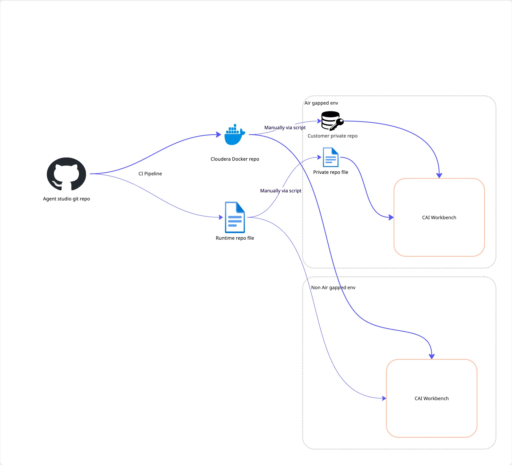
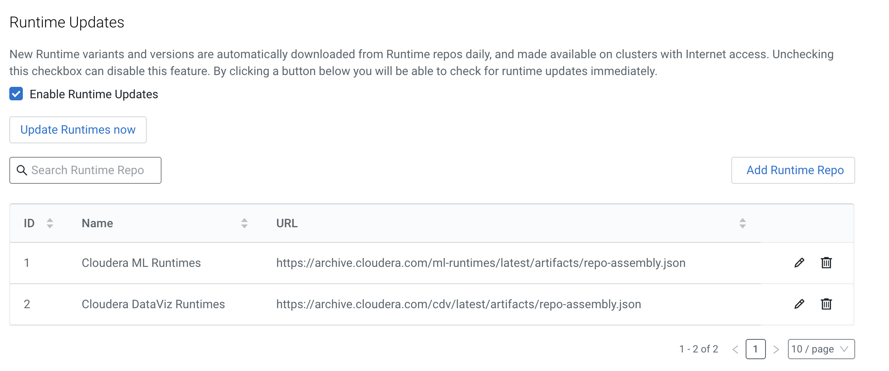

# Agent studio in Air-gapped Environments
## Release Process:
Agent Studio will be delivered as a prebuilt, containerized ML runtime image, unlike the current method of providing raw source code and building environments on customer infrastructure. This ML runtime image will include all necessary code and dependencies (Node, Git, NVM, and Python) to launch Agent Studio.

The agent studio runtime image will be pushed to a Cloudera registry via a CI pipeline. A separate runtime repository file will be generated to store metadata about the runtime image. This approach aligns with the CDV method of shipping CDV runtime images within the Cloudera AI workbench.

The repo file will be hosted on URL  - https://archive.cloudera.com/agent-studio/latest/artifacts/repo-assembly.json which will be accessible publicly (Not behind any paywall)

### Sample runtime repo file -

```json
{
    "assembly_metadata_version": 1,
    "runtimes": [
        {
            "image_identifier": "<host-name>/cloudera/agent-studio:2.0.0-b1",
            "runtime_metadata_version": 2,
            "editor": "PBJ Workbench",
            "kernel": "Agent Studio",
            "description": "Agent Studio runtime provided by Cloudera",
            "edition": "Agent Studio",
            "full_version": "2.0.0.1",
            "short_version": "2.0.0",
            "maintenance_version": 1,
            "git_hash": "008b349ff9799ab3f0eec7e9e3e6d2998969607d",
            "gbn": 67141340
        }
    ]
}
```

## Configure Agent Studio Runtime image:



- Air gapped customers can download the agent studio runtime image from cloudera registry and host it in their private docker registry. 
- Customers can add the docker credentials of this private registry in the workbench. [Adding Docker registry credentials](https://docs.cloudera.com/machine-learning/cloud/runtimes/topics/ml-add-docker-registry-credentials-runtimes.html)
- Additionally, Customers can create their own runtime repo file and host it internally in their environment. [Adding custom runtime repo](https://docs.cloudera.com/machine-learning/cloud/managing-runtimes/topics/ml-adding-custom-ml-runtime-through-runtime-repo.html). Make sure to update the image_identifier value in the self hosted runtime repo file.
- The above steps can be skipped for customers who allow access to cloudera registry and runtime repo file via whitelisting.
- To get the latest Agent Studio runtime image, Site admins should add the repository file entry to Site Admin > Runtimes > Add Runtime Repo.
- The runtime catalog automatically updates with the latest images from the runtime repository files when "Enable Runtime Updates" is selected. Alternatively, you can manually trigger this update by clicking the "Update Runtimes Now" button.



## Configure PyPi mirror repo:
Customers with restricted access to the public PyPi repository must configure a mirror repository. The mirror repository needs to include the following CMLAPI dependencies, which are generated by swagger-codegen during the creation of the CMLAPI Python client.

- certifi >= 14.05.14
- six >= 1.10
- python_dateutil >= 2.5.3
- setuptools >= 21.0.0
- urllib3 >= 1.15.1

In addition to the aforementioned dependencies, any tool-specific dependencies must also be synchronized with the mirror repository.


## Install Agent Studio:
- Configure Runtime Image: Set up the Agent Studio runtime image on the project's Settings -> Runtimes page.
- Configure Environment Variables (if PyPi mirror repo is used):
  - Set UV_DEFAULT_INDEX to the PyPi mirror URL (e.g.,[http://ccycloud.xyz-airgap.root.comops.site:8080/web/simple]).
  - Set UV_INSECURE_HOST to the PyPi mirror host (e.g., ccycloud.xyz-airgap.root.comops.site).
- Create Agent Studio Application: Create an application named "Agent Studio" using the configured runtime image and the script file /studio_app/startup_scripts/run-app.py.
- Note: Ops metrics is now integrated within the Agent Studio application, eliminating the need for a separate application.

Note - In air-gapped environments, the AI Studio feature flag is not required because it needs access to a public GitHub repository and currently does not support airgap setup.


## Upgrade Agent Studio:
- The new runtime image will be published via the runtime repository file.
- If configured, synchronize the repository file and its corresponding Docker image with the self hosted runtime repo file and internal docker repository.
- The runtime image will automatically update in the runtime catalog if "Enable Runtime Update" is checked. Otherwise, manually update it by clicking "Update Runtimes Now."
- Once the new runtime image is available in the runtime catalog, an upgrade alert will appear in the Agent Studio application.
- Upgrade Agent Studio using the provided alert link.
- It will replace the runtime image and restart the application.
