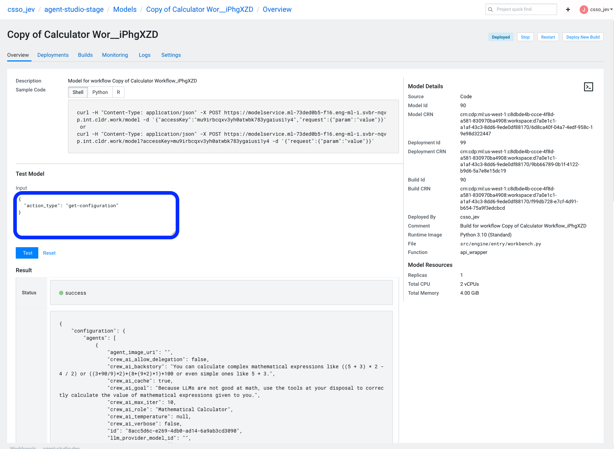

# Cloudera AI Agent Studio - Deployments

## Overview

The deployment system in Cloudera AI Agent Studio provides a robust platform for deploying AI workflows as production-ready endpoints. When a workflow is deployed, it becomes a standalone workflow served by a [CML Workbench Model](https://docs.cloudera.com/machine-learning/cloud/models/topics/ml-models.html) and a [CML Workbench Application](https://docs.cloudera.com/machine-learning/cloud/applications/topics/ml-applications-c.html). The workbench model acts as the workflow engine (unit of work responsible for actually executing workflows) while the application provides a frontend to the deployed workflow.

## Workbench Architecture

### Components

A deployed workflow consists of two main components:

1. **Backend Model**: A CML Workbench Model that serves the workflow engine and handles all workflow execution
2. **Frontend Application** : A CML Workbench Application that provides a user interface for interacting with the workflow

### Workflow Events & Logs

At the core, workflows are asynchronous by nature. Because of this, when a workflow kickoff request is sent to a deployment, the response is a trace ID that can be used to track the status of the workflow. Workflow deployments currently log events and telemetry to the **Agent Studio - Agent Ops & Metrics** appplciation. So a typical workflow performs like the following:
* A user kicks off a workflow from the deployed workflow Application, or sends a kickoff request directly to the model endpoint
* The workflow executes asynchronously within the model deployment, while streaming events and logs to the **Ops & Metrics** server
* The user can poll for events at the `/events` endpoint in the **Ops & Metrics** server to monitor for completion

For more information, see [Monitoring](./monitoring.md)

## Deployed Workflow API

The deployed workbench model comes with it's own API surface. When testing the deployed workflow, or when integrating the deployed workflow with a custom application, users can follow the below endpoint schema to interact with deployed workflows.



In general, requests can be sent directly to the model endpoint with any of our supported APIs (or "action types"). This is an example of a paylod to kickoff a workflow:

```python
MODEL_ENDPOINT = "https://modelservice.<CDSW_DOMAIN>/model?accessKey=<ACCESS_KEY>"
CDSW_APIV2_KEY = "..." # An API key used for authorization to the model endpoint

# Defined during workflow task creation
workflow_inputs = {
  "input1": "value_1"
}
inputs_encoded = base64.b64encode(json.dumps(workflow_inputs).encode("utf-8")).decode("utf-8")

payload = {
  "action_type": "kickoff",
  "kickoff_inputs": inputs_encoded
}

resp = requests.post(
  MODEL_ENDPOINT, 
  json={
    "request": payload
  },
  headers={"authorization": f"Bearer {CDSW_APIV2_KEY}", "Content-Type": "application/json"},
)
out = resp.json()
trace_id = out["response"]["trace_id"]

# This trace ID can be used to extract events from the Ops & Metrics server
print("trace_id: ", trace_id)

```

Below is the entire list of API operations for our deployed workbench models.

### **Kickoff**
**Purpose**: Initiates workflow execution with provided inputs

**Parameters**:
- `kickoff_inputs`: Base64-encoded JSON string containing workflow input parameters, defined during task creation

**Example Request**:
```
payload = {
  "action_type": "kickoff",
  "kickoff_inputs": inputs_encoded
}

resp = requests.post(
  MODEL_ENDPOINT, 
  json={
    "request": payload
  },
  headers={"authorization": f"Bearer {CDSW_APIV2_KEY}", "Content-Type": "application/json"},
)
out = resp.json()
```


**Response**:
```json
{
  "trace_id": "formatted-trace-id"
}
```

### **Get Configuration**
**Purpose**: Retrieves the complete workflow configuration. Can be used to defined custom UIs and experiences
on top of the deployed endpoint.

**Parameters**: None

**Example Request**:
```
payload = {
  "action_type": "get-configuration",
}

resp = requests.post(
  MODEL_ENDPOINT, 
  json={
    "request": payload
  },
  headers={"authorization": f"Bearer {CDSW_APIV2_KEY}", "Content-Type": "application/json"},
)
out = resp.json()
```

**Response**: Returns the full workflow definition containing:
- Language model configurations
- Agent definitions
- Task specifications
- Tool instances
- MCP instances
- Workflow metadata

Example configuration output looks like:

```
{
  "configuration": {
    "agents": [
      {
        "crew_ai_backstory": "You can calculate complex mathematical expressions like ((5 + 3) * 2 - 4 / 2) or ((3+90/9)*2)+(8+(9*2)*1)+100 or even simple ones like 5 + 3.",
        "crew_ai_goal": "Because LLMs are not good at math, use the tools at your disposal to correctly calculate the value of mathematical expressions given to you.",
        ...
        "name": "Calculator Agent",
        "tool_instance_ids": [
          "888608cb-dc08-4d26-82d9-62ae52035b54"
        ]
      }
    ],
    "default_language_model_id": "5dbd9021-4d01-4e3a-8e29-4c69c4b9453a",
    "language_models": [
      {
        "generation_config": {
          "do_sample": true,
          "max_length": null,
          "max_new_tokens": 4096,
          ...
        },
        "model_id": "5dbd9021-4d01-4e3a-8e29-4c69c4b9453a",
        "model_name": "gpt-4o-mini"
      }
    ],
    "mcp_instances": [],
    "tasks": [
      {
        "assigned_agent_id": "8acc5d6c-e269-4db0-ad14-6a9ab3cd3090",
        "description": "For arithmetic expression {expression} , find the result.",
        "expected_output": "Present the result while greeting the user nicely.",
        "id": "271c6053-5113-44d3-878d-431da3ccb664"
      }
    ],
    "tool_instances": [
      {
        "id": "888608cb-dc08-4d26-82d9-62ae52035b54","is_venv_tool": true,
        "name": "Calculator Tool",
        "python_code_file_name": "tool.py",
        "python_requirements_file_name": "requirements.txt",
        "source_folder_path": "studio-data/workflows/copy_of_calculator_workflow_9mdTehB/tools/calculator_tool_vkKaav84",
        "tool_image_uri": "studio-data/dynamic_assets/tool_instance_icons/888608cb-dc08-4d26-82d9-62ae52035b54_icon.png",
        "tool_metadata": "{\"user_params\": [], \"user_params_metadata\": {}, \"status\": \"\"}"
      }
    ],
    "workflow": {
      "agent_ids": [
        "8acc5d6c-e269-4db0-ad14-6a9ab3cd3090"
      ],
      "crew_ai_process": "sequential",
      "description": "This workflow uses a Calculator Agent to accurately evaluate mathematical expressions by leveraging Pydantic for input validation and performing basic arithmetic operations based on user-provided inputs",
      "id": "2e544957-e9da-473f-9e3e-5d03948838d4",
      "is_conversational": false,
      "llm_provider_model_id": "",
      "manager_agent_id": null,
      "name": "Copy of Calculator Workflow",
      "task_ids": [
        "271c6053-5113-44d3-878d-431da3ccb664"
      ]
    }
  }
}
```


### **Get Asset Data**
**Purpose**: Retrieves binary asset data for tools and agents

**Parameters**:
- `get_asset_data_inputs`: List of asset URIs to retrieve such as agent icons, etc.

**Example Request**:
```
payload = {
  "action_type": "get-asset-data",
  "get_asset_data_inputs": [
    "studio-data/dynamic_assets/tool_instance_icons/888608cb-dc08-4d26-82d9-62ae52035b54_icon.png"
  ]
}

resp = requests.post(
  MODEL_ENDPOINT, 
  json={
    "request": payload
  },
  headers={"authorization": f"Bearer {CDSW_APIV2_KEY}", "Content-Type": "application/json"},
)
out = resp.json()
```

**Response**:
```json
{
  "asset_data": {
    "studio-data/dynamic_assets/tool_instance_icons/888608cb-dc08-4d26-82d9-62ae52035b54_icon.png": "base64-encoded-data"
  },
  "unavailable_assets": ["list-of-missing-assets"]
}
```

### **Get MCP Tool Definitions**
**Purpose**: Retrieves Model Context Protocol tool definitions

**Parameters**: None

**Example Request**:
```
payload = {
  "action_type": "get-mcp-tool-definitions",
}

resp = requests.post(
  MODEL_ENDPOINT, 
  json={
    "request": payload
  },
  headers={"authorization": f"Bearer {CDSW_APIV2_KEY}", "Content-Type": "application/json"},
)
out = resp.json()
```

**Response**:
```json
{
  "ready": true,
  "mcp_tool_definitions": {
    "mcp_instance_id": [
      {
        "name": "tool_name",
        "description": "tool_description", 
        "parameters": {...}
      }
    ]
  }
}
```
