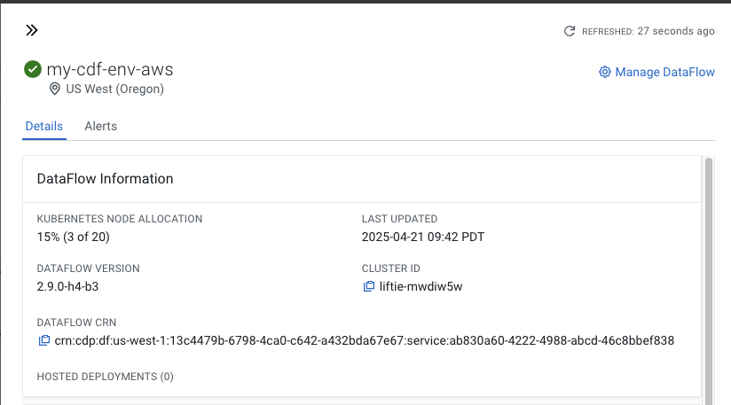
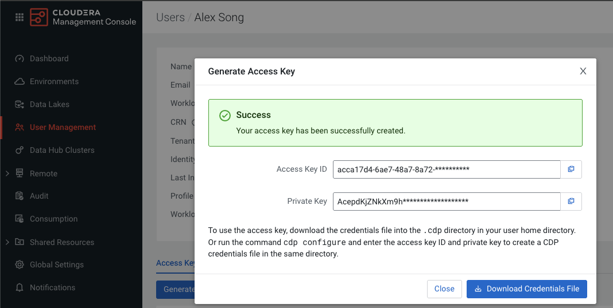

# CDP Data Ingestion(CDF) Readyflow Creation Template
This workflow template is capable of configuring and launching the Huggingface s3 readyflow. Workflow template represents a single activity that may be usaeful in a larger complex qorkflow that may require creation/management of CDF Readyflows for Data ingestion.

## Prereqs
- Active [CDF Dataflow Service](https://docs.cloudera.com/cdp-public-cloud-patterns/cloud/bi-at-scale/topics/pat-bias-enable-df-environment.html)
    - > This is required to create the CDF Readyflow when requested

- SMTP Server
    - > This is required to send notification message with details when the CDF Readyflow is being created


## Agents
### `Data Ingestion Assistant CDF`
This agent has been defined to be able to create a CDF Readyflow to import a HuggingFace Dataset repository into your datalake then send a message via smtp server to notify recipiencts of the creations of the Readyflow.

## Tools
### `hf_s3_readyflow_tool`
This hf_s3_readyflow_tool tool is used for importing a huggingface dataset into a path in the CDP datalake as a set of parquet files by deploying a [CDF HuggingFace to S3/ADLS Readyflow](https://docs.cloudera.com/dataflow/cloud/readyflow-overview-huggingface-s3-adls/topics/cdf-readyflow-huggingface-s3-adls.html). It returns the status of the CDF readyflow instance creation and if successful, the s3_uri of the parquet directory.

This tool has been implemented to use the CDP CDF cli to make requests for readyflow configuration and creation.


The tool requires the following configurations:
- **Service CRN**
  - The service CRN of a running CDF Dataflow
  - This can be found in the details of your CDF Environment as DATAFLOW CRN 
  
- **CDP Access key**
 - This is the Access key that will be used to interact with CDF when the `hf_s3_readyflow_tool` is called. This can be generated in your CDP User Profile.
 
- **CDP Secret/Private key**
 - This is the Secret key that will be used to interact with CDF when the `hf_s3_readyflow_tool` is called. This can be generated in your CDP User Profile.

- **CDP workload_user**
  - This is the workload user that will be used in the CDF Readyflow when ingesting data into the datalake.
- **CDP workload_pass**
  - This is the workload user password that will be used in the CDF Readyflow when ingesting data into the datalake. 

### `Email Tool`
The email tool lets you send email via an SMTP server.

The tool requires the following configurations:
- SMTP Server - The address of the SMTP server.
- SMTP Port – The port number for the SMTP connection.
- SMTP Password – The authentication password for the SMTP server.


## Usage
This template has been defined with a basic conversational task initiation. Requests should be made in the form of natural language requests to ingest a Huggingface dataset into a particular location in the CDP Datalake.

Ex.
If I want to ingest a dataset like https://huggingface.co/datasets/charuanchlia/census_pop into my datalake, my chat request could look like:
```
Please ingest huggingface dataset charuanchlia/census_pop into bucket s3a://cai-eng-datalakes and path /demo-env/census_datasets
```