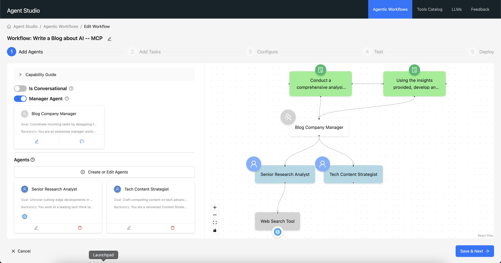

# Using MCP Servers in Agent Studio: DuckDuckGo Example

This tutorial demonstrates how to integrate and use Model Context Protocol (MCP) servers in Cloudera AI Agent Studio. We'll walk through setting up the DuckDuckGo Search MCP server and creating a workflow that utilizes its capabilities.

## Overview

Model Context Protocol (MCP) enables AI agents to securely connect to external data sources and tools. In this example, we'll integrate the [DuckDuckGo Search MCP server](https://github.com/nickclyde/duckduckgo-mcp-server) which provides web search capabilities and content fetching features.

## Prerequisites

- Access to Cloudera AI Agent Studio
- Basic understanding of Agent Studio workflows

## Step 1: Access the MCP Servers Section

First, navigate to the Tools Catalog and access the MCP Servers section.

1. Go to **Tools Catalog** in Agent Studio
2. Click on the **MCP Servers** tab
3. You'll see the option to "Register a MCP Server" along with any existing MCP servers


## Step 2: Register the DuckDuckGo MCP Server

To register a new MCP server, click the **"Register"** button.


In the registration dialog:

1. **MCP Server Configuration**: Enter the following JSON configuration:

```json
{
    "mcpServers": {
        "DuckDuckGo": {
            "command": "uvx",
            "args": ["duckduckgo-mcp-server"]
        }
    }
}
```

2. **Icon**: Optionally upload a PNG or JPEG image (max 64KB) to customize the MCP server icon
3. **Runtime Support**: Note that only `uvx` (for Python-based) and `npx` (for Node.js-based) are supported as runtimes for MCP servers currently
4. **Server Name**: The MCP server name will be "DuckDuckGo" based on the configuration
5. Click **"Register"** to add the server

## Step 3: Verify MCP Server Registration

After successful registration, the DuckDuckGo MCP server will appear in your Tools Catalog.


You can see the DuckDuckGo server is now listed among your available MCP servers with a Python runtime indicator.

## Step 4: Explore Available Tools

Click on the DuckDuckGo MCP server to view its available tools and capabilities.


The DuckDuckGo MCP server provides two main tools:

### 1. Search Tool
- **Description**: Search DuckDuckGo and return formatted results
- **Arguments**: 
  - `query`: The search query string
  - `max_results`: Maximum number of results to return (default: 10)

### 2. Fetch Content Tool
- **Description**: Fetch and parse content from a webpage URL
- **Arguments**: 
  - `url`: The webpage URL to fetch content from

## Step 5: Create a Workflow with MCP Integration

Now let's create a workflow that uses the DuckDuckGo MCP server.



In this example, a workflow called "Write a Blog about AI -- MCP" has been created with:

1. **Manager Agent**: Enabled to coordinate the workflow
2. **Two Agents**:
   - **Senior Research Analyst**: For uncovering cutting-edge developments in AI and data science
   - **Tech Content Strategist**: For crafting compelling content on tech advancements

## Step 6: Add MCP Server to Agents

To integrate the DuckDuckGo MCP server with your agents, you need to add it to each agent that will use the search capabilities.


In the "Add or Edit MCPs" dialog:

1. **Select MCP Server**: Choose DuckDuckGo from the available servers
2. **Select Tools**: Check the tools you want to enable:
   - ✅ **search**: Search DuckDuckGo and return formatted results
   - ✅ **fetch_content**: Fetch and parse content from a webpage URL
3. **Add to Agents**: The server can be added to different agents in your workflow

## Step 7: Configure Agent with MCP Tools

When editing an agent, you can see the MCP server has been successfully added.


The agent configuration shows:
- **Role**: Tech Content Strategist
- **Backstory**: Detailed description of the agent's expertise
- **Goal**: Craft compelling content on tech advancements
- **LLM Model**: gemini (Default)
- **Add Optional MCP Servers**: DuckDuckGo server is now available and can be managed

## Step 8: View Complete Workflow with MCP Tools

Once you've added the MCP server to your agents, you can see the complete workflow structure.


The workflow now shows:
- Both agents (Senior Research Analyst and Tech Content Strategist) have DuckDuckGo MCP servers attached
- Each agent shows the available tools: `search` and `fetch_content`
- The workflow structure remains the same, but now the agents have access to web search capabilities

## Step 9: Execute and Test the Workflow

Finally, you can test your workflow to see the MCP integration in action.


The test results show:
- **Generated Content**: The workflow successfully generated a blog post titled "AI Unleashed: The Game-Changing Tech Reshaping Our World in 2024"
- **MCP Integration**: The agents used the DuckDuckGo search tools to research current AI developments
- **Comprehensive Output**: The blog post includes insights about generative AI integration, multimodal AI capabilities, and specialized AI agents

The content demonstrates how the agents leveraged the MCP server's search capabilities to gather real-time information and create compelling, well-researched content.

## Key Features Demonstrated

This example showcases several important MCP integration capabilities:

- **Tool Discovery**: Agent Studio automatically discovers and catalogs MCP server tools
- **Multi-Agent Coordination**: Different agents can use the same MCP server tools
- **Real-time Integration**: Live web search and content fetching capabilities
- **Workflow Integration**: MCP tools seamlessly integrate into existing Agent Studio workflows
- **Tool Selection**: Flexible selection of which MCP tools to enable for each agent

## Best Practices

- **Tool Selection**: Only enable the MCP tools that each agent actually needs
- **Runtime Requirements**: Ensure the appropriate runtime (`uvx` for Python, `npx` for Node.js) is available
- **Error Handling**: Design your workflows to handle potential MCP server connection issues

## Next Steps

After completing this tutorial, you can:

1. **Explore Other MCP Servers**: Try integrating other MCP servers like Puppeteer, filesystem tools, or database connectors
2. **Create Complex Workflows**: Build more sophisticated multi-agent workflows that combine multiple MCP servers
3. **Deploy to Production**: Deploy your tested workflow as a Workbench Model for production use
4. **Custom Applications**: Build custom UIs and applications on top of your deployed workflows

## Additional Resources

- [MCP Protocol Documentation](https://modelcontextprotocol.io/introduction)
- [DuckDuckGo MCP Server GitHub](https://github.com/nickclyde/duckduckgo-mcp-server)
- [Agent Studio MCP Integration Guide](./mcp.md)
- [Agent Studio Workflows User Guide](./workflows.md) 